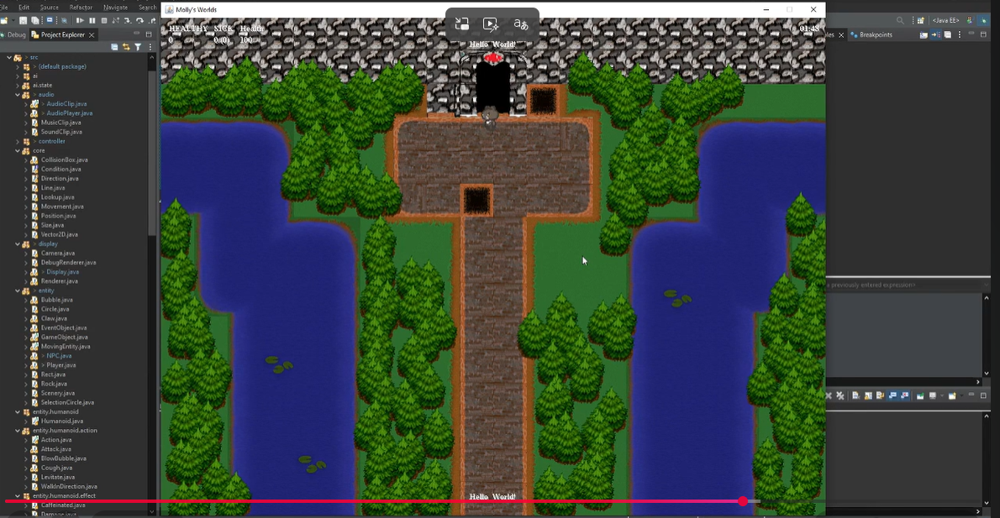

# Java 2D Game Engine

A 2D game engine and game built **from scratch in pure Java** — no external game framework. Custom game loop, component-based entities, AI state machines, a full UI toolkit, and an in-game level editor.


<!-- Run the game (Launcher.java), take a screenshot, save it as docs/screenshot.png -->

## Highlights

- **Custom game loop** with fixed-timestep updates and render separation (`game/GameLoop.java`, `game/Time.java`)
- **Component-based entities**: `GameObject` → `MovingEntity` → `Player` / `NPC`, with composable movement, collision, and animation
- **AI state machine**: NPCs driven by states (`Stand`, `Wander`) with transitions and conditions (`ai/`)
- **Homegrown UI framework**: buttons, sliders, checkboxes, tab containers, tooltips, and a clickable minimap, with alignment and spacing layout logic (`ui/`)
- **In-game level editor**: a dedicated editor state for building maps inside the engine (`state/editor`)
- **Core math and physics primitives**: `Vector2D`, `CollisionBox`, `Movement`, ray/line utilities (`core/`)
- Audio, input handling, sprite/graphics management, and map serialization (`audio/`, `input/`, `gfx/`, `map/`, `io/`)

## Project structure

```
src/
├── ai/          state machine: states, transitions, conditions
├── audio/       sound playback
├── controller/  input-to-action mapping
├── core/        vectors, collision, movement, positions
├── display/     window and rendering surface
├── entity/      GameObject hierarchy, Player, NPCs
├── game/        Game, GameLoop, Time, levels, settings
├── gfx/         sprites and image management
├── input/       keyboard and mouse
├── io/          save/load
├── map/         tile maps
├── state/       menu, game, and level editor states
├── ui/          UI component framework
└── Launcher.java
```

## Run it

Requires Java 8+. Open the project in any Java IDE (Eclipse/IntelliJ) and run `Launcher.java`, which starts the game loop in a 1280x960 window.

## Why this project

Built solo for CMP 428 (Game Programming) to understand what engines like Unity do under the hood: the loop, the entity model, UI layout, and state management — implemented by hand.

---
**Jonathan Rosario** · [Portfolio](https://github.com/Zypherous) · [LinkedIn](https://www.linkedin.com/in/jonathan-r-tech-professional/)
